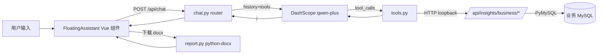

# AI 业务分析助手（悬浮球）

在主站右下角渲染紫色悬浮球，点击打开 420×600 对话窗口，仿 Claude.ai 风格：左 AI 气泡、右用户气泡、快捷芯片、输入框。回复中若含 `<data_card>...</data_card>` 会渲染为「报表卡片」（3 列 KPI + 迷你进度条排名），若含 `<report_content>...</report_content>` 会渲染为「报告卡片」并提供「下载 .docx」按钮。

## 1. 架构概览



两段式：

- **Planner**（默认 `qwen-plus`）做意图识别；吃**最近 6 条 user/assistant 历史**，`needClarify=true` 时才反问。
  - **二次反问熔断**：若上一条 assistant 已是问号结尾（说明在等澄清），当前用户消息一律视为答复，强制跳过 planner 的反问分支、直接进 answerer。
- **Answerer**（默认 `qwen-max`）带 tools 做最多 5 轮 Function Calling，最后要求输出 `<data_card>` 或 `<report_content>` 标签。

工具不直接写 SQL，而是通过 `httpx` 回调本地 `/api/insights/business/*`，复用现成口径。

## 2. 配置

### 2.1 获取 DashScope API Key

1. 登录阿里云百炼 <https://bailian.console.aliyun.com/>。
2. 控制台右上角 → **API-KEY 管理** → 新建 → 复制形如 `sk-xxxxxxxxxxxxxxxxxxxxxxxx` 的值。

### 2.2 注入环境变量（Docker Compose）

在仓库根目录的 `.env`（与 `docker-compose.yml` 同级；不要提交到 git）写：

```bash
AI_API_KEY=sk-你的密钥
# 以下可选，默认见下表
AI_PROVIDER=dashscope
AI_BASE_URL=https://dashscope.aliyuncs.com/compatible-mode/v1
AI_MODEL_PLANNER=qwen-plus
AI_MODEL_ANSWER=qwen-max
ASSISTANT_COMPANY_NAME=食迅易联
```

`aiagent/docker-compose.yml` 的 `agent.environment` 已通过 `${AI_API_KEY:-}` 等形式注入容器，改完 `.env` 后重启即可：

```bash
cd ~/Documents/ai-agent
docker compose up -d --build agent
```

未配置 `AI_API_KEY` 时**自动走 mock 模式**：关键词命中（"排名 / 区域 / 品类 / 日报 / 周报 / 趋势"）返回预制的 `<data_card>` / `<report_content>`，工具仍真实查库，用于拿到 Key 前完整演示。

## 3. 离线 / VPN 场景（数据库结构与接口样例缓存）

开着 VPN 时业务 MySQL 连不上，`/api/insights/business/*` 返回 503，工具会拿不到真数据。为此系统内置了 **catalog 缓存**：

- 文件位置：`aiagent/backend/data/ai_chat_catalog.json`（容器内 `/app/backend/data/ai_chat_catalog.json`；可通过 `ASSISTANT_CATALOG_PATH` 覆盖）。
- 内容：`api_samples`（几条代表接口的真实 JSON 响应）+ `tables`（`meta/tables` 输出 + 关键表的 `SHOW COLUMNS`）。

### 3.1 查看当前缓存

```bash
curl -sS http://localhost:8000/api/chat/catalog
```

### 3.2 关掉 VPN、连得上库时抓一次

```bash
curl -sS -X POST http://localhost:8000/api/chat/catalog/refresh \
  -H 'Content-Type: application/json' -d '{"include_tables": true}'
```

成功后，下次再开 VPN 时工具会优先读缓存里的 `api_samples` 作为兜底（而不是抛错），AI 助手的演示不再卡住。

把 `aiagent/backend/data/ai_chat_catalog.json` 提交到 git 也可以，这样其他人拉下来就能离线演示。

## 4. API 形状

### 4.1 `POST /api/chat`

```json
// 请求
{
  "messages": [
    {"role": "user", "content": "今天哪个区卖得最好，给我出个排名"}
  ],
  "session_id": "optional-uuid"
}

// 响应
{
  "reply": "……（含 <data_card> 或 <report_content> 标签）",
  "data_card": { "type": "rank", "title": "…", "kpis": [...], "rows": [...] },
  "report_content": null,
  "session_id": "xxxx",
  "debug": { "mock": true, "intent": {...}, "tool_calls": [...] }
}
```

### 4.2 `POST /api/chat/report/export`

```json
{
  "title": "每日经营日报",
  "markdown": "# 日报\n\n## KPI\n\n| 指标 | 数值 |\n|---|---|\n| 订单 | 179 |\n",
  "filename": "daily_2026-04-21"
}
```

返回 `.docx` 二进制，`Content-Disposition: attachment; filename=report.docx; filename*=UTF-8''xxx.docx`。

### 4.3 `GET /api/chat/catalog` / `POST /api/chat/catalog/refresh`

见第 3 节。

## 5. 演示脚本

### 5.1 区域销售排名

**问法**：「今天哪个区卖得最好，给我出个排名」

**预期**：`data_card.type = "rank"`；KPI 三格：入榜数量 / 合计金额 / 榜首；表格逐行 `区县 + GMV + 迷你进度条`。

### 5.2 趋势报告

**问法**：「华东区本月趋势」

**预期**：`data_card.type = "trend"`（或 `kpi`）；KPI 呈现区间总订单 / GMV / 客单价；简要文字说明。

### 5.3 今日日报（报告卡片 + 下载）

**问法**：「生成今日日报」

**预期**：`report_content` 为 Markdown 字符串（H1 标题 + 「核心指标」「区域 TOP」「品类 TOP」「每日趋势」「建议」五节，含表格）；报告卡片右上角「下载 .docx」按钮 POST `/api/chat/report/export`，返回 Word 文档。

### 5.4 越界请求

**问法**：「帮我报销 500 元」

**预期**：命中「只处理销售/订单/客户/品类/区域/履约相关问题」约束，礼貌回绝。

## 6. 组件清单

### 后端

- `backend/app/routers/chat.py` — HTTP 入口（挂在 `/api/chat`）
- `backend/app/services/ai_chat/llm_client.py` — OpenAI SDK 兼容 DashScope；`AI_API_KEY` 为空时走 mock
- `backend/app/services/ai_chat/tools.py` — 6 个 function + dispatcher（httpx 回调本地接口；失败时读 catalog）
- `backend/app/services/ai_chat/prompt.py` — System Prompt + Planner Prompt + few-shot
- `backend/app/services/ai_chat/report.py` — `markdown-it-py` 解析 + `python-docx` 输出
- `backend/app/services/ai_chat/session.py` — `cachetools.TTLCache` 存最近 10 轮
- `backend/app/services/ai_chat/schema_catalog.py` — 离线缓存读写

### 前端

- `frontend/src/components/assistant/FloatingAssistant.vue` — 悬浮球 + 窗口容器
- `frontend/src/components/assistant/ChatWindow.vue` — 420×600 面板
- `frontend/src/components/assistant/ChatMessage.vue` — 气泡 + 卡片解析
- `frontend/src/components/assistant/DataCard.vue` — KPI + 排名表（迷你进度条）
- `frontend/src/components/assistant/ReportCard.vue` — Markdown 预览 + 下载 .docx 按钮
- `frontend/src/composables/useAssistantChat.js` — messages / session_id / 10 轮裁剪 / 加载与错误态
- `frontend/src/api/chat.js` — 走现有 `request.js`

## 7. 数据流与安全

### 7.1 会发送给 DashScope 的字段（需要打通云端 LLM 才能工作）

- 管理层的**对话文本**（问题 + AI 历史答复，最近 10 轮）。
- **工具返回结果**（OpenAI 规范的 tool_result JSON），常见字段：
  - GMV、订单数、客单价、退货占比等聚合指标；
  - 区域名（海淀区、朝阳区…）、品类 / 商品名；
  - 日期、时间窗口；
  - **脱敏后的 TOP 会员**：姓名仅保留首字（例：`张**`）、手机号保留前 3 后 4（例：`138****5678`）。

### 7.2 不会发送给 DashScope 的字段

- 业务数据库账号密码（`INSIGHTS_MYSQL_*`、`SXW_MYSQL_*`）只存在于容器 env 与容器内网调用中，永不随 prompt 外发。
- 会员**完整姓名、完整手机号、原始地址、身份证号**：代码在 `tools.py -> get_top_members` 出口处强制脱敏后才交给 LLM。
- `key` / `secret`（高德、萤石、乐橙、北斗等）与所有 `*_TOKEN`。

### 7.3 脱敏实现位置

脱敏函数在 `backend/app/services/ai_chat/tools.py` 里：

- `_mask_name(n)` 保留首字，其余统一替换为 `**`；
- `_mask_phone(s)` 用正则 `(?<!\d)(1[3-9]\d)(\d{4})(\d{4})(?!\d)` 匹配大陆手机号并打星；
- `_mask_member_row(r)` 对 `member_name/name/buyer_name/nickname` 与 `member_phone/phone/mobile/buyer_phone` 字段逐个应用上面两个函数；
- `dispatch_tool_call("get_top_members", ...)` 返回前对 `data.rows` 全量遍历脱敏，并打 `data._pii_masked = true` 标记供排查。

### 7.4 合规边界

- 阿里云百炼 DashScope 默认**不将调用内容用于模型训练**；数据中心在境内（详见阿里云百炼用户协议）。
- 本项目的 `AI_BASE_URL` 固定走 OpenAI 兼容模式，只和 DashScope 通信；切走其它 Provider 时需同步评估合规。

### 7.5 两个收紧开关（给运维）

- **完全离线**：在 `.env` 里把 `AI_API_KEY` 置空并重启 `agent` → 后端自动走 mock（本地关键词匹配 + 真查库），**一个字都不出网**。
- **禁用客户排名**：把 `backend/app/services/ai_chat/tools.py` 中 `TOOLS` 列表里的 `get_top_members` 注释掉；AI 今后遇到「TOP 客户」类问题只能从其它工具里取不到 PII 的聚合，再次收紧攻击面。

## 8. 关于「今日数据」的时效性

代码里所有工具的「今天」**都是 `date.today()` 动态解析**：

- `tools.py -> _daterange_for_report` 用 `date.fromisoformat(base) if base else date.today()`；
- `prompt.py -> build_system_prompt` 每次请求都会重新读 `date.today().isoformat()` 写进 system prompt；
- `kpi-summary?scope=today` 由业务侧实时聚合 `orders` 当天数据。

所以只要 VPN 关掉 / MySQL 可达，**明天问「今日数据」就是明天当天的真实数据**，不会沿用今天的缓存；`ai_chat_catalog.json` 里的 `api_samples` 仅在业务接口不可达时作为兜底样例，不会与实时查询互相污染。

## 9. 流式对话 `POST /api/chat/stream`

前端默认走 SSE 流式接口，让回答看起来像是「AI 正在思考 / 打字」。协议：

| 事件 | data 结构 | 说明 |
| --- | --- | --- |
| `phase` | `{phase, label}` | `planning` / `querying` / `clarify` / `answering` —— 前端用来换「连接 AI」「查询业务数据」「整理回答」等气泡内标签 |
| `intent` | `{intent, already_clarifying}` | planner 的识别结果与「是否已反问过」熔断开关 |
| `tool` | `{name, args?, status}` | `status=calling` 开始 / `status=done` 结束；前端展示「正在查询 get_region_rank…」 |
| `delta` | `{text}` | 文本增量（每 2 字一帧），前端 append 到气泡内容 |
| `done` | `{reply, data_card, report_content, session_id, debug}` | 完整结构化结果，前端用它最终渲染卡片 |
| `error` | `{message}` | 中途失败；前端自动降级到 `POST /api/chat` 非流式请求 |

为什么不直接透传 DashScope 原生 delta？因为本项目多轮 FC 的 delta 里会掺着 `tool_calls` 的字段碎片，前端拼文本会看到 JSON 穿插。所以后端先把 planner + tool 循环跑完拿到 **最终文本**，再以 22ms/字节奏 replay；体验接近真实流式，且 `data_card` 能在末尾一次稳拿。节奏可通过 `ASSISTANT_STREAM_DELAY_MS` / `ASSISTANT_STREAM_PHASE_DELAY_MS` 调节。

前端按 `useAssistantChat.js` 的约定，流式失败会**自动降级**为 `POST /api/chat` 同步 JSON，保证连接不可用时依然出答。

## 10. 边界与后续

- 未加 `/api/chat` 权限，沿用主站登录态。如需限流/审计可在该路由增加依赖。
- 工具只覆盖读，不做写入。
- `schema_catalog` 目前只抓示例接口 JSON 和少数关键表结构，需要更全时可在 `_SAMPLE_PROBES` 里补充条目。
- 深度思考 / 多步推理模式：业务问题在二阶段 (planner + answerer 带 FC) 已经能稳定拿到数据，暂不接入 `qwen-*-thinking` 思维链。后续如果接入，建议只对 `report_type=monthly` 月报启用，避免日常对话过慢。
