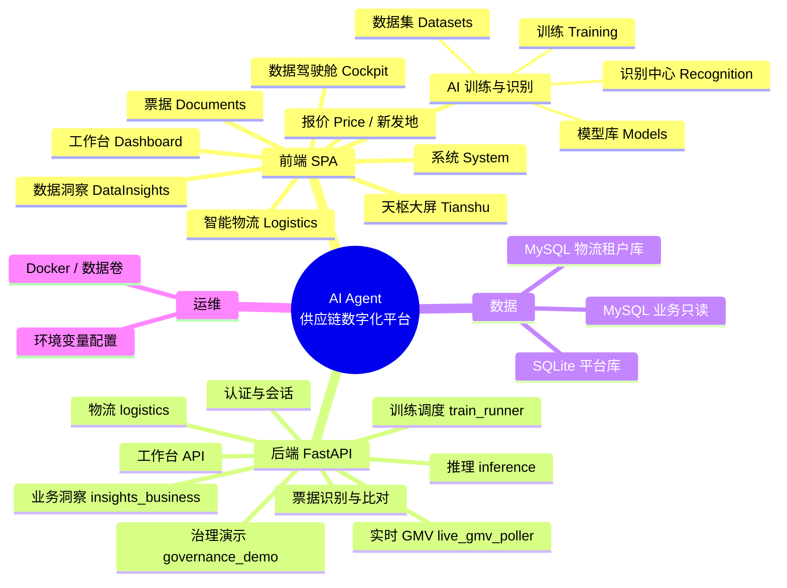

# 模块架构与脑图

## 1. 分层架构（逻辑视图）

```
┌─────────────────────────────────────────────────────────────┐
│                     展示层（Vue3 SPA）                       │
│  工作台 / 驾驶舱 / 天枢大屏 / 数据洞察 / 物流 / 票据 / 系统    │
└───────────────────────────┬─────────────────────────────────┘
                            │ HTTPS / WSS / REST
┌───────────────────────────▼─────────────────────────────────┐
│                  应用层（FastAPI）                            │
│  路由：dashboard · datasets · training · models · analysis   │
│       recognition · categories · documents · insights_business│
│       logistics · governance_demo · xinfadi（报价）          │
└───────────┬─────────────────────────────┬─────────────────┘
            │                             │
┌───────────▼──────────┐       ┌──────────▼──────────────────┐
│ 平台域服务            │       │ 业务洞察域服务                │
│ SQLite ORM · 训练执行 │       │ 只读 SQL · schema 白名单      │
│ 推理 · 日志 · 物流表  │       │ live_gmv 轮询 · WS 广播      │
└───────────┬──────────┘       └──────────┬──────────────────┘
            │                             │
┌───────────▼─────────────────────────────▼───────────────────┐
│                        数据层                                 │
│  SQLite（平台） │ 业务 MySQL（INSIGHTS_* 只读）│ SXW MySQL（物流）│
└─────────────────────────────────────────────────────────────┘
```

## 2. Mermaid 脑图（可在支持 Mermaid 的编辑器中渲染）



## 3. 后端路由模块一览

| 前缀 | 模块 | 职责摘要 |
|------|------|----------|
| `/api/dashboard` | 工作台 | 指标、趋势等首页数据 |
| `/api/datasets` | 数据集 | 上传、列表、预览 |
| `/api/training` | 训练 | 创建任务、状态、取消 |
| `/api/models` | 模型库 | 列表、部署 |
| `/api/analysis` | 分析 | **仅 SELECT** 的 SQL 查询 |
| `/api/insights/business` | 业务洞察 | KPI、分布、地图点、热力、**WebSocket live-gmv** 等 |
| `/api/recognition` | 识别 | 上传推理、预置模型部署 |
| `/api/categories` | 类别 | 类别训练数据管理 |
| `/api/doc` | 票据 | 识别引擎、流式进度、与订单比对 |
| `/api/logistics` | 物流 | 车辆、设备、轨迹、费用 |
| `/api/governance` | 治理演示 | 演示用路由 |
| 新发地相关 | xinfadi | 批发价等（见 `app/xinfadi`） |

## 4. 前端路由一览

| 路径 | 页面 | 说明 |
|------|------|------|
| `/login` | 登录 | 公开 |
| `/` | 工作台 | 默认首页 |
| `/cockpit` | 数据驾驶舱 | 全屏 |
| `/tianshu` | 天枢大屏 | 全屏，可嵌静态大屏资源 |
| `/datasets` ~ `/system` | 各业务页 | 需登录 |
| `/logistics/*` | 智能物流 | 绑定、轨迹、费用 |

## 5. 架构示意图（图片）

同目录下 **`platform-architecture-mindmap.png`** 为汇报用意象图（与代码一一对应关系以本文文字为准）。

---

*脑图源码为 Mermaid，便于纳入 Git 与后续改版；PPT 可导出为 SVG/PNG。*
