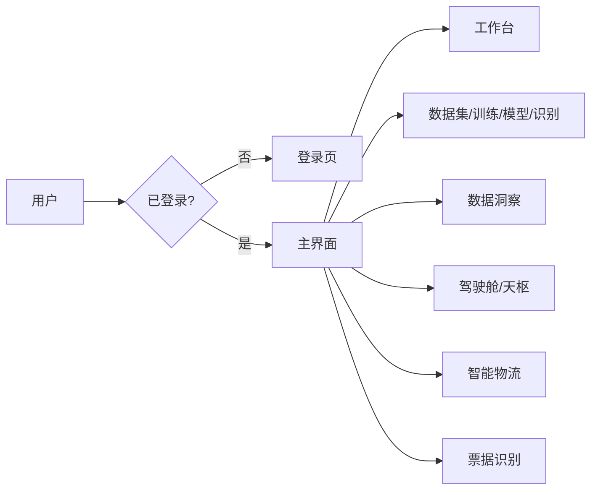
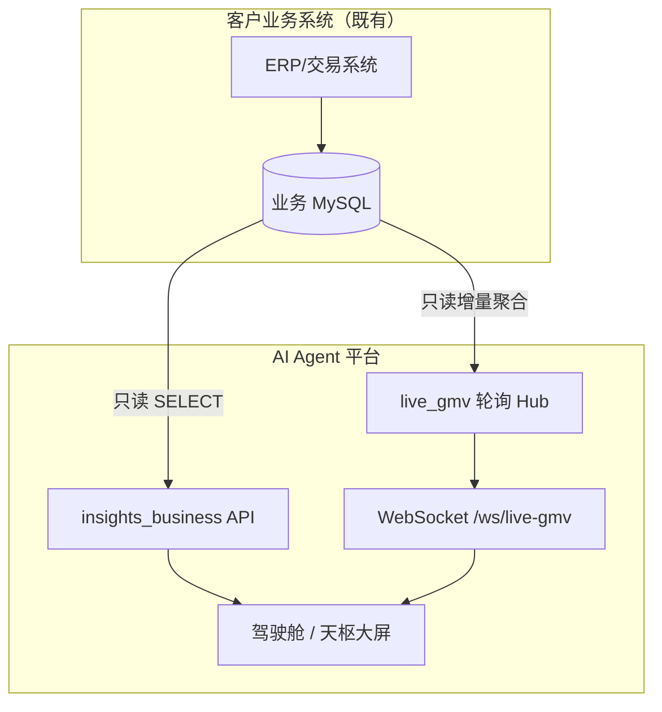
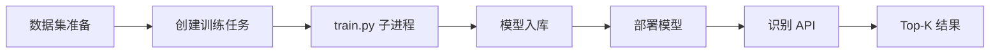
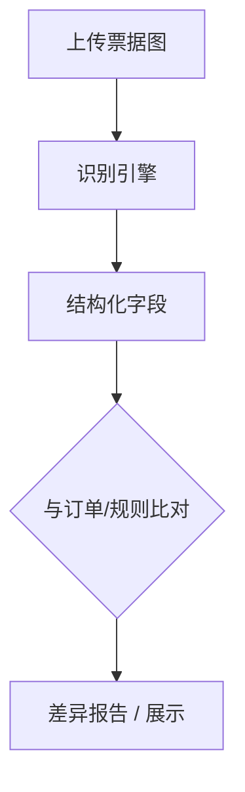

# 业务流程图（端到端）

以下流程强调 **平台在供应链数字化中的旁路位置**：消费数据、AI 处理、展示与稽核，**不替代**核心交易系统写库。

## 1. 主链路：登录后使用平台能力

## 2. 只读业务洞察 + 实时 GMV

## 3. AI 训练—部署—识别

## 4. 票据识别与比对（概念）

---

*若需插入 Word/PPT，可用 VS Code、Typora、Mermaid Live Editor 导出 PNG/SVG。*
