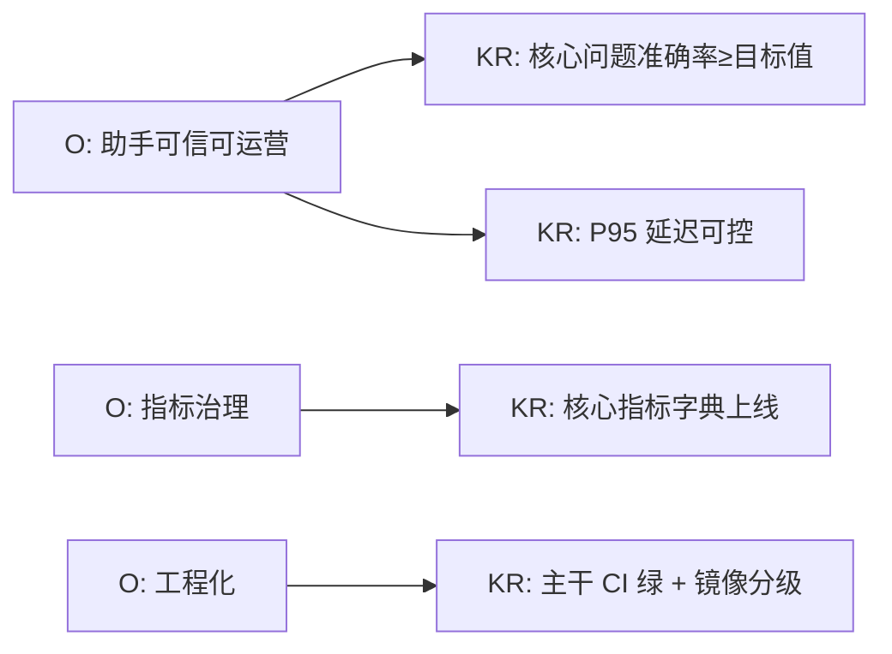
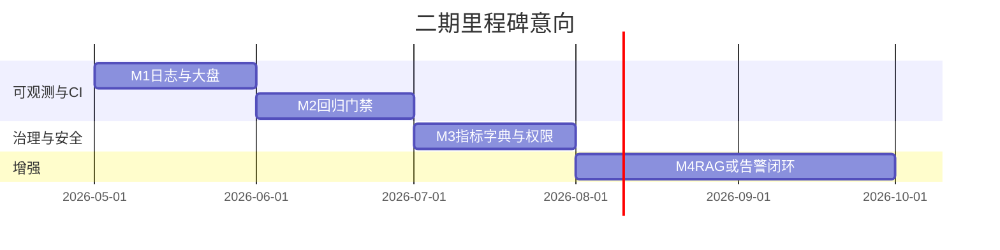

# AI Agent 数据智能平台

**二期建设规划书**

*版本：2026.04 · 目标：在一期交付基础上做「可规模化、可度量、可运营」的升级*

---

## 0. 规划摘要

| 维度 | 一期现状 | 二期目标 |
|------|-----------|----------|
| AI 助手 | 功能完整、快速通道 + 流式体验 | **可观测、可 A/B、权限到字段级** |
| 数据洞察 | 白名单 SQL + 大屏 | **指标治理、血缘、缓存策略显性化** |
| 物流 IoT | 多源接入 | **统一设备模型、告警闭环** |
| 工程 | 单仓单体 | **CI/CD、环境分级、压测基线** |

**规划原则**：优先 **高业务价值 / 低风险** 项；每项具备 **验收指标** 与 **Owner**（实施时补全人名）。

---

## 一、背景与动因

1. **管理侧**：AI 助手已从「能用」走向「每天用」，需要 **质量看板、成本看板、问题工单化**。  
2. **数据侧**：指标增多后，需 **统一定义与版本**（避免同一词不同口径）。  
3. **运维侧**：Docker 一键起适合研发；生产需要 **灰度、回滚、密钥轮换**。  
4. **合规侧**：会话与导出行为可能面临 **审计留痕** 要求。

---

## 二、二期目标体系（OKR 示意）

> **说明**：具体数值（准确率、P95 秒数）建议在二期启动会上由业务与研发共同签字。

---

## 三、专题规划

### 3.1 AI 业务助手 — 质量与成本

| 编号 | 事项 | 说明 | 验收参考 |
|------|------|------|----------|
| A1 | **对话与工具可观测** | 结构化日志：session_id、intent、tool 名称、耗时、是否 fast_path；可选对接现有日志平台 | 可按 session 还原一次问数路径 |
| A2 | **回归门禁化** | 将 `scripts/run_chat_regression.py` 纳入 CI，失败阻断合并 | main 分支定时或每次 MR 执行 |
| A3 | **模型与策略 A/B** | Planner/Answerer 模型、温度、快速通道开关走配置中心或环境分层 | 预发可切换对比报表 |
| A4 | **RAG / 知识库（可选）** | 接入内部制度、品类说明、FAQ；**严格**引用边界，防止编造 | 带 citation 的回答样例评审通过 |
| A5 | **权限与范围** | 按角色限制区县、敏感工具；导出加水印与操作人 | 安全评审 checklist |

### 3.2 数据洞察 — 指标治理与中台化

| 编号 | 事项 | 说明 | 验收参考 |
|------|------|------|----------|
| D1 | **指标字典** | 每个对外指标：定义、SQL 摘要、刷新频率、负责人 | 文档 + 接口 `/meta/metrics` 草案 |
| D2 | **缓存与降级策略显性化** | 对高 QPS 接口标注 TTL、穿透保护；大屏与助手共用策略说明 | 压测报告一页纸 |
| D3 | **物化视图 / 汇总表（按需）** | 对极重 SQL 评估离线预聚合，在线查汇总表 | 关键接口 P95 下降比例 |

### 3.3 可视化与体验

| 编号 | 事项 | 说明 | 验收参考 |
|------|------|------|----------|
| V1 | **驾驶舱主题与布局模板化** | 支持「城市总览 / 区域 drill / 活动大促」等布局一键切换 | 2 套以上模板可切换 |
| V2 | **移动端适配（按需）** | 助手与关键 KPI 页响应式或独立 H5 | 主流手机浏览器自测通过 |
| V3 | **无障碍与国际化预留** | 关键组件 aria、文案外置 | 抽检通过 |

### 3.4 智能物流与 IoT

| 编号 | 事项 | 说明 | 验收参考 |
|------|------|------|----------|
| L1 | **设备数字孪生统一模型** | 车辆、摄像头、GPS 统一 ID 与状态机 | 单接口可查设备健康度 |
| L2 | **告警 → 工单（可选）** | 异常停留、离线、视频中断等进入待办 | 与钉钉/企微 webhook 打通其一 |

### 3.5 工程与交付

| 编号 | 事项 | 说明 | 验收参考 |
|------|------|------|----------|
| E1 | **GitHub Actions / GitLab CI** | lint、前端 build、后端 pytest、回归脚本 | badge 绿色 |
| E2 | **镜像分级** | `dev` / `staging` / `prod` tag 与不同 env 文件 | 生产无明文密钥 |
| E3 | **OpenAPI 驱动契约测试** | 对 `/api/insights/business` 核心路径做 smoke | 每日定时 |

---

## 四、里程碑建议（甘特意向）

> 以下为 **季度级** 粗粒度排期，实施前需按人力校准。

| 阶段 | 时间盒 | 交付物 |
|------|--------|--------|
| **M1：可观测** | 第 1 个月 | A1 日志方案 + 基础大盘；E1 CI 主干 |
| **M2：质量门禁** | 第 2 个月 | A2 回归进 CI；核心接口压测 D2 |
| **M3：治理与权限** | 第 3 个月 | D1 指标字典 v1；A5 角色权限 v1 |
| **M4：增强可选包** | 第 4 个月起 | A4 RAG 试点 / L2 告警 二选一深化 |

---

## 五、风险与依赖

| 风险 | 缓解措施 |
|------|----------|
| 大模型 API 价格波动 | 缓存热点问法、小模型兜底高频意图 |
| 业务 SQL 变更 | 指标字典 + 回归用例双轨维护 |
| 第三方地图 / IoT 限流 |  backoff + 本地缓存 + 降级文案 |

**外部依赖**：DashScope 或后续多厂商 LLM、高德配额、业务库网络策略。

---

## 六、资源与角色（模板）

| 角色 | 职责 |
|------|------|
| 产品经理 | 优先级、指标字典业务签字 |
| 后端负责人 | insights、chat、CI、性能 |
| 前端负责人 | 驾驶舱、助手 UX、可视化性能 |
| 数据 / DBA | 慢 SQL、汇总表、权限视图 |
| 运维 | 密钥、监控、灰度发布 |

---

## 七、结语

二期核心不是「再堆功能」，而是把一期已验证的 **问数、看板、物流** 能力 **产品化、可运营、可审计**，为三期「多租户 / 开放 API / 行业解决方案打包」打地基。

---

**— 规划书结束 —**

*本文档为规划草案，以立项评审后版本为准*

